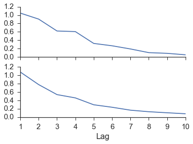
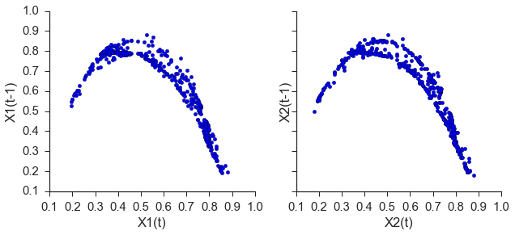
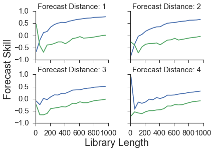
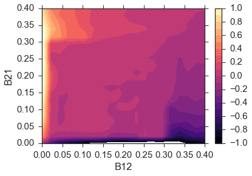

skCCM
========

This package is an implementation of [convergent cross mapping][ccm-wiki] (CCM) using scikit-learn's style. More specifically it is an implementation from the paper, [Detecting Causality in Complex Ecosystems][ccm-paper]. It reconstructs [phase spaces][phase-space] to analyze the effects of one system on the other.

Quick Explanation
-----------------

[State Space Reconstruction: Convergent Cross Mapping by Sugihara Lab][ccm-youtube]

Examples
--------
First, import skCCM and generate the coupled logistic map from the paper mentioned above.

```python
import skCCM.skCCM as ccm
import skCCM.data as data

rx1 = 3.72 #determines chaotic behavior of the x1 series
rx2 = 3.72 #determines chaotic behavior of the x2 series
b12 = 0.2 #Influence of x1 on x2
b21 = 0.01 #Influence of x2 on x1
ts_length = 1000
x1,x2 = data.coupled_logistic(rx1,rx2,b12,b21,ts_length)
```


Next, we need to embed the time series. The mutual information must be calculated in order to establish an appropriate lag.

```python
em_x1 = ccm.embed(x1)
em_x2 = ccm.embed(x2)

mi1 = em_x1.mutual_information(10)
mi2 = em_x2.mutual_information(10)
```



Since the mutual information is continually decreasing we will take the minimum to be at one. Now we can embed the series using the appropriate lag and we can find the appropriate embedding dimension through a [false near neighbor test][false-nn] (not shown).

```python
lag = 1
embed = 2
predict = 4
X1,y1 = em_x1.embed_vectors_1d(1,2,4)
X2,y2 = em_x2.embed_vectors_1d(1,2,4)
```


Now that the time series has been embedded, we can now do the convergent cross mapping.

```python
CCM = ccm.ccm()
sc1, sc2 = CCM.predict_causation(X1,y1,X2,y2)
```


As seen in the figure above, the forecast skill for X1 (X1 xmap X2) is much higher than the forecast skill for X2 (X2 xmap X1). This is to be expected as B12 was larger than B21. The larger forcing of X2 by X1 results in a higher forecast skill of X1 by using the weights from X2.

skCCM also allows the testing of library length on forecast skill.

```python
lib_lens = np.arange(10,ts_length,ts_length/20) #library lengths
x1_xmap_x2, x2_xmap_x1 = CCM.predict_causation_lib_len(X1,y1,X2,y2,lib_lens)
```



The four plots above show the same pattern with `X1 xmap X2` being greater than `X2 xmap X1` for all forecast distances.

For completeness, we also reproduce figure 3B from the paper where the color represents the forecast skill of `X2 xmap X1` minus `X1 xmap X2`. This results in large values when B21 is large and B12 is small. Similarly, it results in smaller values when B12 is large and B21 is small.



For more examples check out the notebooks included with this repository.

[phase-space]: https://en.wikipedia.org/wiki/Phase_space)
[nlf-book]: http://www.amazon.com/Nonlinear-Time-Analysis-Holger-Kantz/dp/0521529026/ref=sr_1_8?ie=UTF8&qid=1452278686&sr=8-8&keywords=nonlinear+analysis
[nn-algo]: https://en.wikipedia.org/wiki/K-nearest_neighbors_algorithm
[sknn-algo]: http://scikit-learn.org/stable/modules/neighbors.html
[scikit]: http://scikit-learn.org/stable/
[false-nn]: http://www.mpipks-dresden.mpg.de/~tisean/TISEAN_2.1/docs/chaospaper/node9.html
[ccm-wiki]: https://www.wikiwand.com/en/Convergent_cross_mapping
[ccm-paper]: http://science.sciencemag.org/content/338/6106/496
[ccm-youtube]: https://www.youtube.com/watch?v=NrFdIz-D2yM


